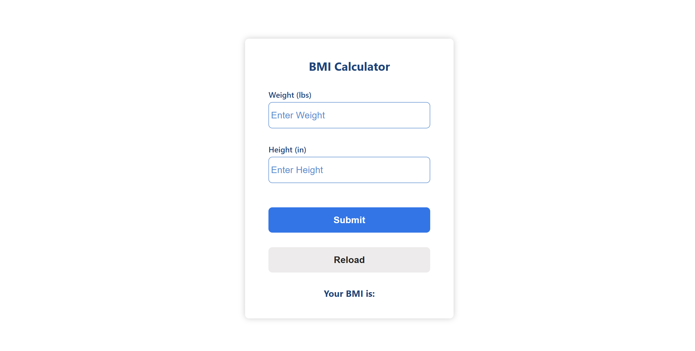

# 🧮 BMI Calculator Website (React)

A simple and responsive Body Mass Index (BMI) calculator built using React. Users can input their height and weight to instantly calculate their BMI and receive a health status based on standard BMI categories.


## 📷 Screenshots



## 📦 Tech Stack

- React (with Hooks)
- CSS 
- Create React App

  

  ## 🚀 Features

- Real-time BMI calculation.
- Supports Imperial (ft/in/lbs) units.
- Clean and modern UI.
- Responsive design for mobile and desktop.
- Easy to customize and extend.


## 🔧 Installation

1. **Clone the repository:**

```bash
git clone https://github.com/shelavalepallavi/bmi-calculator.git
cd bmi-calculator
```

2. **Install dependencies:**

```bash
npm install
```


```

4. **Open in Browser:**

Visit `http://localhost:3000` (or as specified in your terminal)

## 📁 Folder Structure

```
src/
│
├── components/       # Reusable components (e.g., InputField, ResultCard)
├── utils/            # Utility functions (e.g., bmi calculator logic)
├── App.js           # Main component
├── index.js         # Entry point
└── styles/           # CSS/Tailwind configs
```

## 🧠 BMI Formula

```
BMI = weight (kg) / [height (m)]²
```

- Underweight: < 18.5  
- Normal weight: 18.5–24.9  
- Overweight: 25–29.9  
- Obesity: BMI of 30 or greater

## 📌 To-Do / Possible Improvements

- Add BMI chart
- Toggle between metric and imperial units
- Store past calculations in local storage
- Dark mode support

